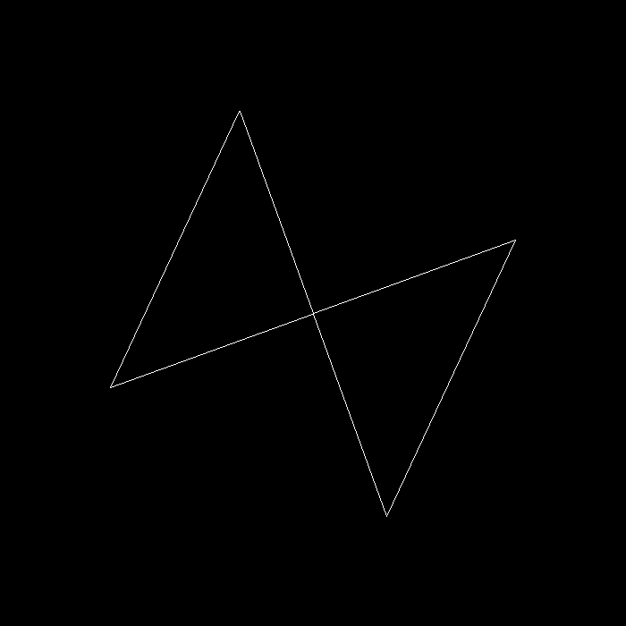

# Assignment 1
In this assignment, the files you need to understand and modify are: `rasterizer.hpp` and `main.cpp`. The `rasterizer.hpp` file is responsible for generating the renderer interface and drawing.

The Rasterizer class plays an important role in this program system, with its member variables and functions as follows:

Member Variables:
* Matrix4f `model`, `view`, `projection`: Three transformation matrices.
* vector\<Vector3f> `frame_buf`: Frame buffer object, used to store color data that needs to be drawn on the screen.

Member Functions:
* `set_model(const Eigen::Matrix4f& m)`: Passes the internal model matrix as a parameter to the rasterizer.
* `set_view(const Eigen::Matrix4f& v)`: Sets the view transformation matrix as the internal view matrix.
* `set_projection(const Eigen::Matrix4f& p)`: Sets the internal projection matrix to the given matrix p and passes it to the rasterizer.
* `set_pixel(Vector2f point, Vector3f color)`: Sets the screen pixel (x, y) to the color (r, g, b) and writes it to the corresponding frame buffer location.

In `main.cpp`, we simulate the graphics pipeline. We first define an instance of the Rasterizer class and then set its necessary variables. Then we get two hard-coded triangles with three vertices. In the main function, we define three functions that respectively calculate the model, view, and projection matrices, each returning the respective matrix. Then, the return values of these three functions are passed into the rasterizer with the `set_model()`, `set_view()`, and `set_projection()` functions. Finally, the rasterizer displays the transformed results on the screen.

After transforming a given geometry with the model, view, and projection matrices, we obtain the canonical space coordinates of the three vertices. The canonical space coordinates consist of $x, y, z$ coordinates, each ranging from $[-1,1]$. The next step is the viewport transformation, mapping the coordinates to our screen (window_width * window_height), which is already completed in the rasterizer, so you don't need to worry about it. However, it is very important that you understand how this operation works.

# Compile and Run
```
mkdir build
cd build
cmake ..
make
```

```
// Run the program in a loop, creating a window display, and you can
// use the WASD keys to move the triangle, QE keys to rotate the triangle
// and the ZX keys to sclae the triangle.
./Rasterizer

// Scale the triangle by 1, rotate the it by 20 degrees, 
// move it by (0 ,0) then save the result in image.png.
./Rasterizer -s 1 -r 20 -t 0 0 -n image.png    
```

# Expected Results
```
./Rasterizer -s 1 -r 20 -t 0 0 -n image.png
```
