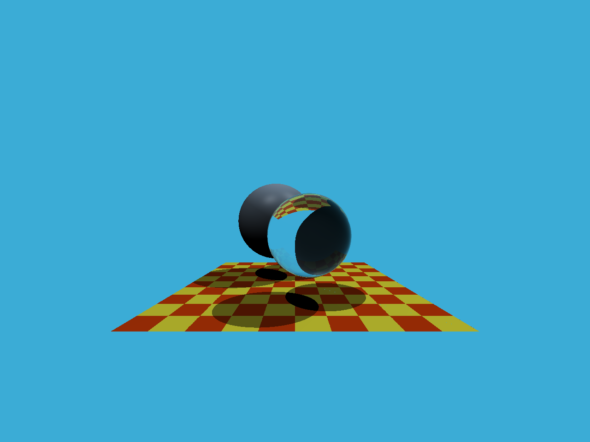
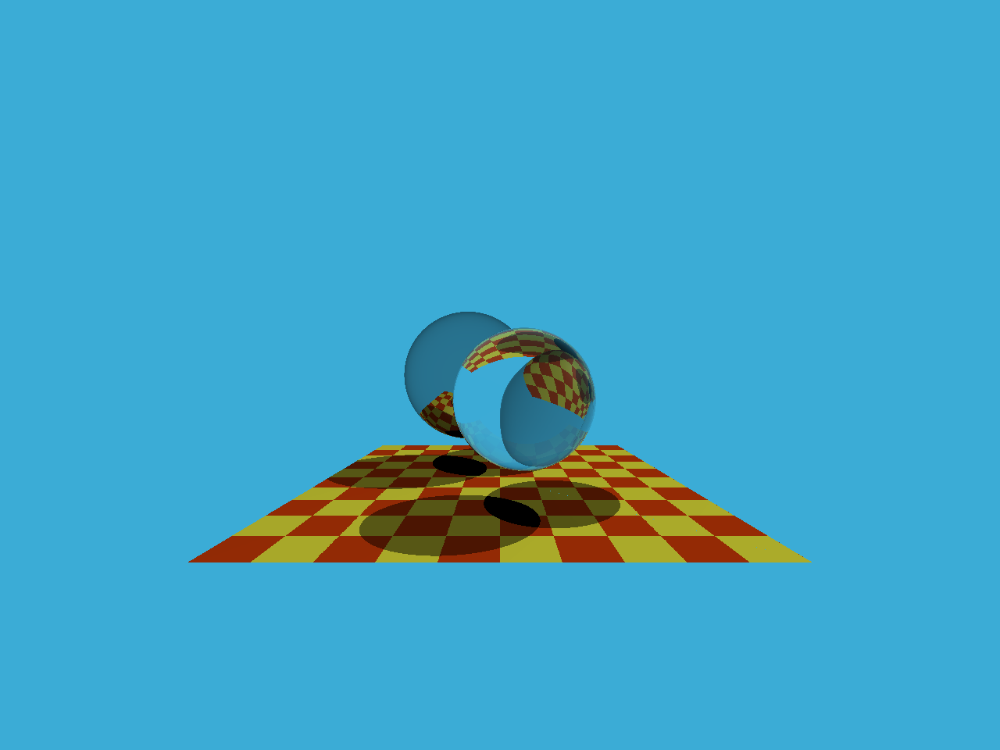
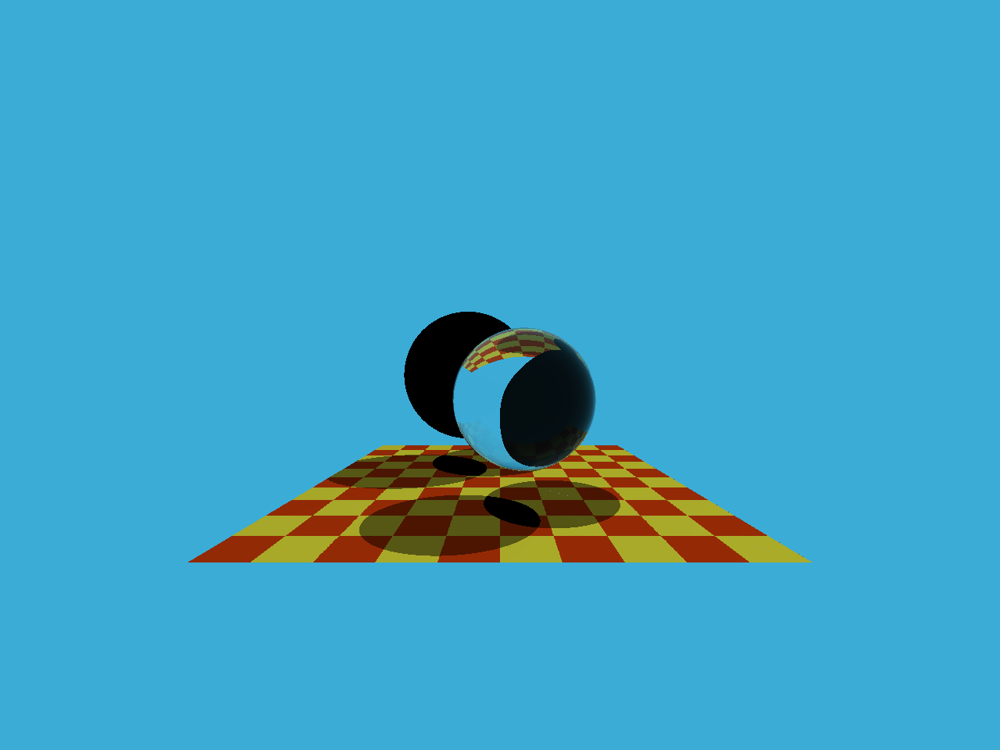

# Assignment 5

## Overview
In this part of the course, we will focus on using ray tracing to render images. One of the most important operations in ray tracing is finding the intersection points between rays and objects. Once the intersection points between rays and objects are found, shading can be performed and the pixel color returned. In this assignment, we need to implement two parts: the generation of rays and the intersection of rays with triangles. The workflow of this code framework is as follows:

1. Start from the `main` function. We define the parameters of the scene, add objects (spheres or triangles) to the scene, set their materials, and then add light sources to the scene.

2. Call the `Render(scene)` function. In the loop that traverses all pixels, generate the corresponding rays and save the returned color in the framebuffer. After the rendering process, the information in the framebuffer will be saved as an image.

3. After generating the rays corresponding to the pixels, we call the `CastRay` function, which calls `trace` to find the intersection point of the ray with the nearest object in the scene.

4. Then, we perform shading at this intersection point. We have set up three different shading scenarios and have provided the code for you.

The functions you need to modify are:

* `Render()` in `Renderer.cpp`: Here, you need to generate a corresponding ray for each pixel, then call the function `castRay()` to get the color, and finally store the color in the corresponding pixel of the framebuffer.

* `rayTriangleIntersect()` in `Triangle.hpp`: v0, v1, v2 are the three vertices of the triangle, orig is the starting point of the ray, and dir is the unit direction vector of the ray. tnear, u, v are parameters that you need to update using the Moller-Trumbore algorithm derived in our class.

## Compile and Run
```
mkdir build
cd build
cmake ..
make
./RayTracing
```

## Results


